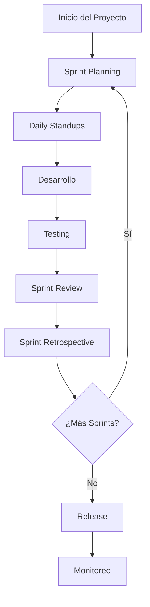
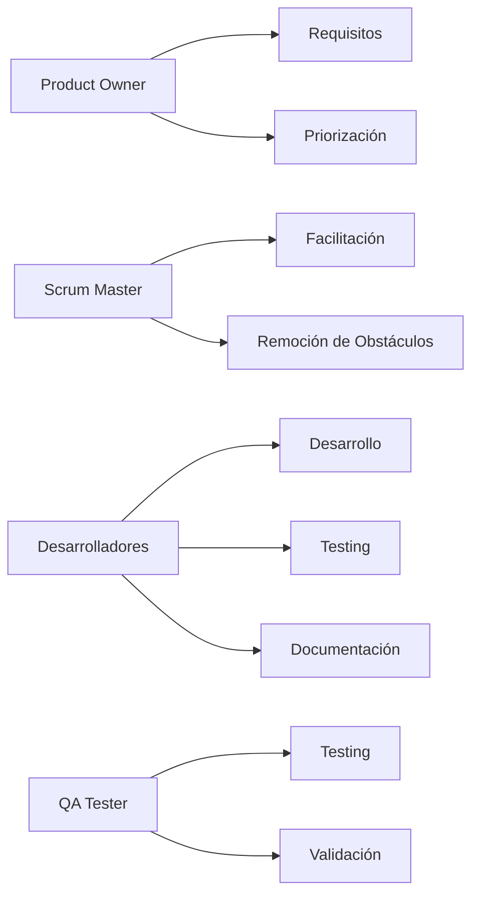
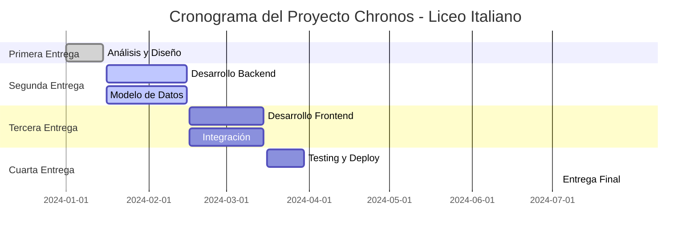
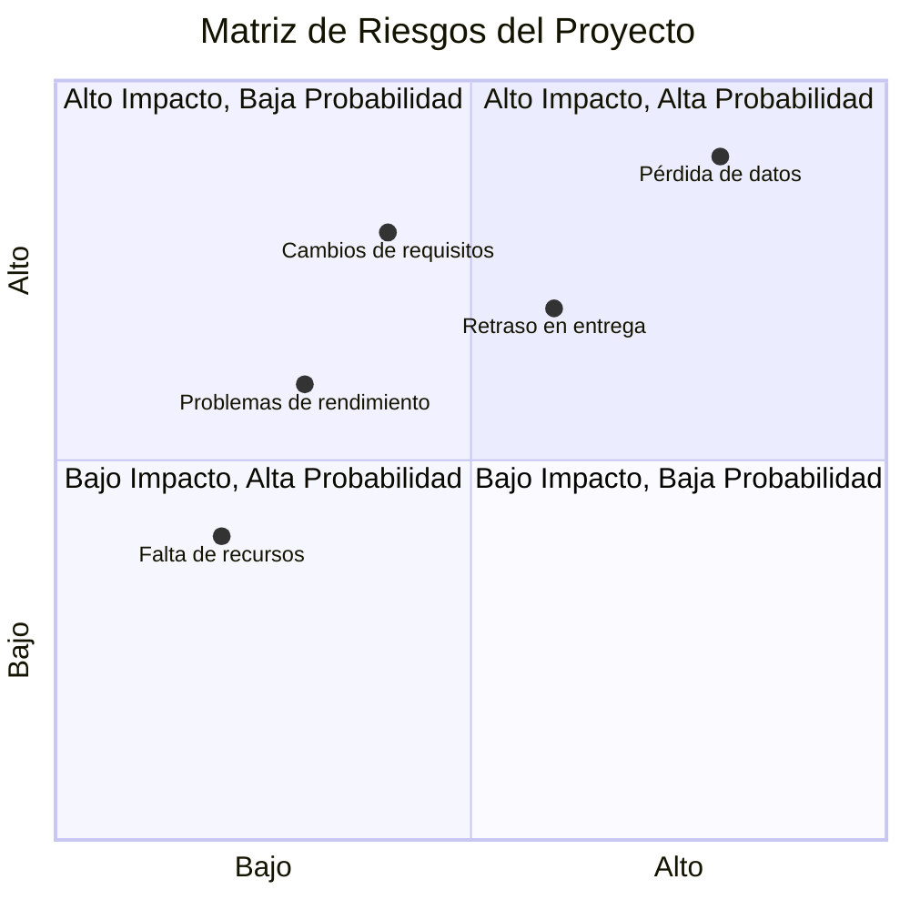
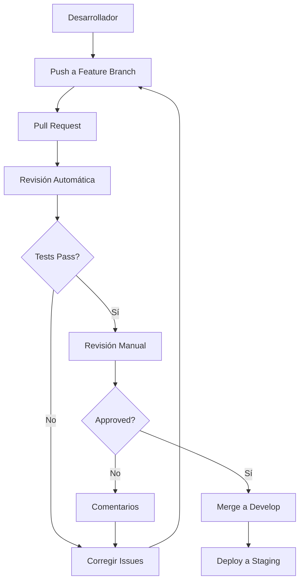
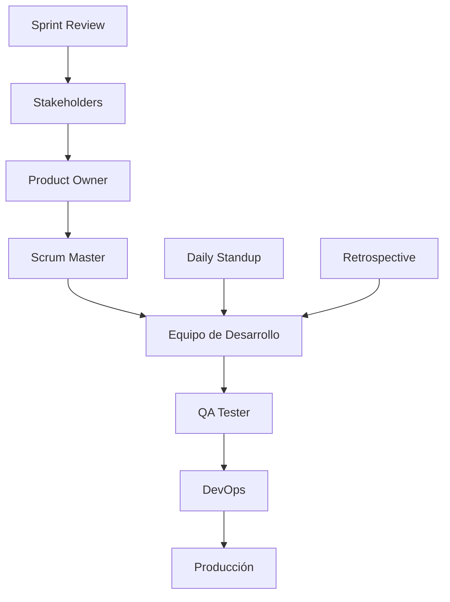

# Gestión de Proyecto - Segunda Entrega

## Metodología de Desarrollo

### Enfoque Adoptado
- **Metodología:** Desarrollo Ágil con elementos de Scrum
- **Iteraciones:** Sprints de 2 semanas
- **Reuniones:** Daily standups, Sprint planning, Retrospectivas
- **Documentación:** Continua y actualizada

### Información del Proyecto
- **Nombre del Proyecto:** S.I.G.I.E Chronos E.S.R.E
- **Institución:** Liceo Italiano
- **Fecha de Entrega:** 28/07/2025
- **Equipo de Desarrollo:**
  - **Coordinador:** Juan Chapuis (5.630.283-4)
  - **Sub-Coordinador:** Agustin Roizen (6.339.592-9)
  - **Integrante:** Bruno Marino (5.707.620-6)

## Diagrama de Metodología de Desarrollo

## Estructura del Equipo

### Roles y Responsabilidades

## Planificación del Proyecto

### Fases del Proyecto

### Entregables por Fase

#### Primera Entrega: Análisis y Diseño
- [x] Especificación de requisitos (ESRE)
- [x] Modelo de datos conceptual
- [x] Arquitectura del sistema
- [x] Casos de uso
- [x] Diagramas UML

#### Segunda Entrega: Desarrollo Backend
- [x] Configuración de base de datos PostgreSQL
- [x] Modelos de datos (Usuario, Materia, Grupo, Horario, Asignacion)
- [x] Gestión de disponibilidad docente
- [x] Sistema de observaciones
- [x] Controladores API
- [x] Autenticación y autorización por roles
- [x] Validaciones de negocio (pautas ANEP)

#### Tercera Entrega: Desarrollo Frontend
- [ ] Interfaces de usuario por rol
- [ ] Generación automática de horarios
- [ ] Edición manual de horarios
- [ ] Gestión de disponibilidad docente
- [ ] Integración con backend
- [ ] Responsive design
- [ ] Validaciones del lado cliente

#### Cuarta Entrega: Testing y Deploy
- [ ] Pruebas unitarias
- [ ] Pruebas de integración
- [ ] Pruebas de usuario (60 usuarios concurrentes)
- [ ] Configuración Docker (PHP 8.3, PostgreSQL 16, Nginx)
- [ ] Documentación final
- [ ] Entrega final (28/07/2025)

## Gestión de Riesgos

### Matriz de Riesgos

### Plan de Contingencia

#### Riesgos Críticos
1. **Pérdida de datos**
   - **Mitigación:** Respaldo automático diario
   - **Contingencia:** Procedimiento de recuperación documentado

2. **Retraso en entrega**
   - **Mitigación:** Buffer de tiempo en cronograma
   - **Contingencia:** Priorización de funcionalidades

3. **Cambios de requisitos**
   - **Mitigación:** Reuniones regulares con stakeholders
   - **Contingencia:** Proceso de cambio controlado

## Control de Calidad

### Proceso de Revisión de Código

### Criterios de Aceptación

#### Funcionalidad
- [ ] Cumple con los requisitos especificados
- [ ] Maneja casos de error apropiadamente
- [ ] Validaciones de entrada implementadas
- [ ] Respuesta en tiempo aceptable

#### Código
- [ ] Sigue estándares de codificación
- [ ] Documentación actualizada
- [ ] Tests unitarios incluidos
- [ ] Sin código duplicado

#### Seguridad
- [ ] Validación de entrada
- [ ] Sanitización de datos
- [ ] Autenticación implementada
- [ ] Autorización verificada

## Métricas del Proyecto

### KPIs de Desarrollo
- **Velocidad del equipo:** [Story points por sprint]
- **Tiempo de resolución de bugs:** [Días promedio]
- **Cobertura de tests:** [Porcentaje]
- **Tiempo de deploy:** [Minutos]

### Métricas de Calidad
- **Bugs por funcionalidad:** [Número]
- **Tiempo de revisión de código:** [Horas]
- **Satisfacción del usuario:** [Puntuación 1-10]
- **Disponibilidad del sistema:** [Porcentaje]

## Comunicación del Proyecto

### Flujo de Comunicación

### Herramientas de Comunicación
- **Reuniones:** Microsoft Teams / Zoom
- **Documentación:** Confluence / Notion
- **Código:** GitHub / GitLab
- **Proyecto:** Azure DevOps / Jira
- **Comunicación:** Slack / Discord

## Documentación del Proyecto

### Tipos de Documentación
1. **Técnica**
   - Especificación de requisitos
   - Diseño de arquitectura
   - Documentación de API
   - Guías de instalación

2. **Funcional**
   - Manual de usuario
   - Casos de uso
   - Flujos de trabajo
   - Guías de administración

3. **Proyecto**
   - Plan de proyecto
   - Cronograma
   - Matriz de riesgos
   - Reportes de estado

### Estándares de Documentación
- **Formato:** Markdown para documentación técnica
- **Idioma:** Español para usuarios, Inglés para código
- **Versionado:** Controlado con Git
- **Actualización:** Continua y sincronizada con el código
