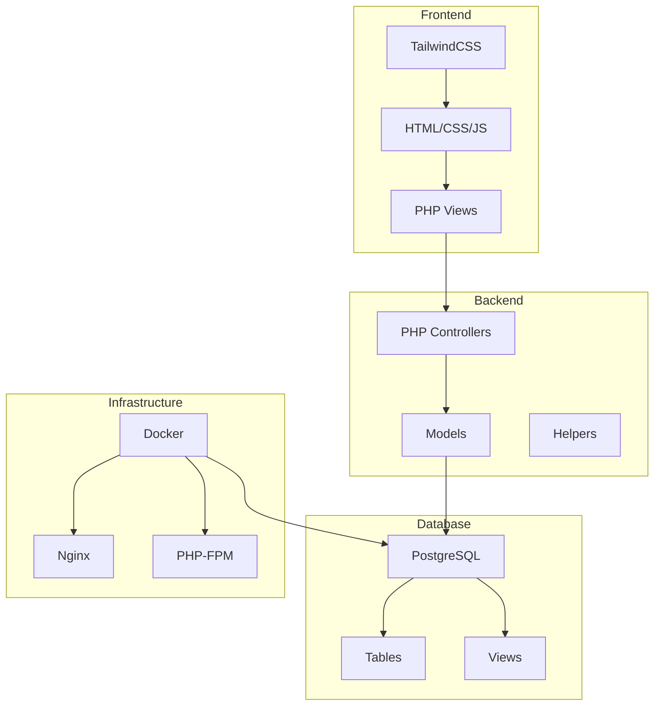
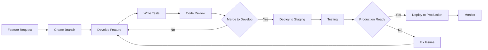

# Repo Git y Estructura del Proyecto - Segunda Entrega

## Repositorio Git

### Configuración del Repositorio
- **URL del repositorio:** [Enlace al repositorio]
- **Ramas principales:** main, develop, feature/*
- **Estrategia de branching:** GitFlow

### Estructura de Commits
```
feat: nueva funcionalidad
fix: corrección de bugs
docs: documentación
style: formato, punto y coma faltante, etc
refactor: refactorización de código
test: agregar tests
chore: tareas de mantenimiento
```

## Diagrama de Flujo de Git

```mermaid
gitgraph
    commit id: "Initial commit"
    branch develop
    checkout develop
    commit id: "Setup project structure"
    branch feature/auth
    checkout feature/auth
    commit id: "Add login system"
    commit id: "Add user validation"
    checkout develop
    merge feature/auth
    commit id: "Merge auth feature"
    branch feature/reservations
    checkout feature/reservations
    commit id: "Add reservation model"
    commit id: "Add reservation controller"
    checkout develop
    merge feature/reservations
    commit id: "Merge reservations feature"
    checkout main
    merge develop
    commit id: "Release v1.0"
```

## Estructura del Proyecto

### Organización de Carpetas
```
chronos/
├── src/
│   ├── components/          # Componentes reutilizables
│   ├── config/             # Configuraciones
│   ├── controllers/        # Controladores MVC
│   ├── helpers/           # Funciones auxiliares
│   ├── lang/              # Archivos de idiomas
│   ├── models/            # Modelos de datos
│   └── views/             # Vistas/templates
├── public/                # Archivos públicos
│   ├── assets/           # Recursos estáticos
│   ├── css/              # Estilos
│   └── js/               # JavaScript
├── docs/                 # Documentación
├── docker/               # Configuración Docker
└── academic/             # Documentos académicos
```

## Diagrama de Arquitectura del Sistema



## Herramientas Utilizadas

### Control de Versiones
- **Git:** Control de versiones distribuido
- **GitHub/GitLab:** Hosting del repositorio
- **GitFlow:** Estrategia de branching

### Desarrollo
- **PHP 8.1+:** Lenguaje de programación backend
- **PostgreSQL:** Base de datos relacional
- **TailwindCSS:** Framework de CSS
- **Docker:** Containerización

### Infraestructura
- **Nginx:** Servidor web
- **PHP-FPM:** Procesador PHP
- **Docker Compose:** Orquestación de contenedores

## Métricas de Proyecto

### Estadísticas de Código
- **Líneas de código PHP:** [Número]
- **Archivos de configuración:** [Número]
- **Templates/Vistas:** [Número]
- **Modelos de datos:** [Número]

### Control de Versiones
- **Commits totales:** [Número]
- **Ramas activas:** [Número]
- **Pull requests:** [Número]
- **Issues cerrados:** [Número]

## Flujo de Desarrollo



## Configuración de Git

### .gitignore
```gitignore
# Dependencies
node_modules/
vendor/

# Environment
.env
.env.local
.env.production

# Logs
*.log
logs/

# Database
*.sqlite
*.db

# IDE
.vscode/
.idea/
*.swp
*.swo

# OS
.DS_Store
Thumbs.db

# Build
dist/
build/
```

### Configuración de Hooks
- **pre-commit:** Validación de sintaxis PHP
- **pre-push:** Ejecución de tests
- **commit-msg:** Validación de formato de mensaje

## Documentación del Código

### Estándares de Código
- **PSR-12:** Estándar de codificación PHP
- **PHPDoc:** Documentación de funciones y clases
- **Comentarios:** Explicación de lógica compleja

### Ejemplo de Documentación
```php
/**
 * Crea una nueva reserva en el sistema
 * 
 * @param string $cedula Cédula del usuario
 * @param int $aula_id ID del aula
 * @param int $horario_id ID del horario
 * @param int $materia_id ID de la materia
 * @param string $fecha Fecha de la reserva (Y-m-d)
 * @param string $motivo Motivo de la reserva
 * 
 * @return array Resultado de la operación
 * @throws Exception Si la reserva no puede ser creada
 */
public function crearReserva($cedula, $aula_id, $horario_id, $materia_id, $fecha, $motivo) {
    // Implementación...
}
```
