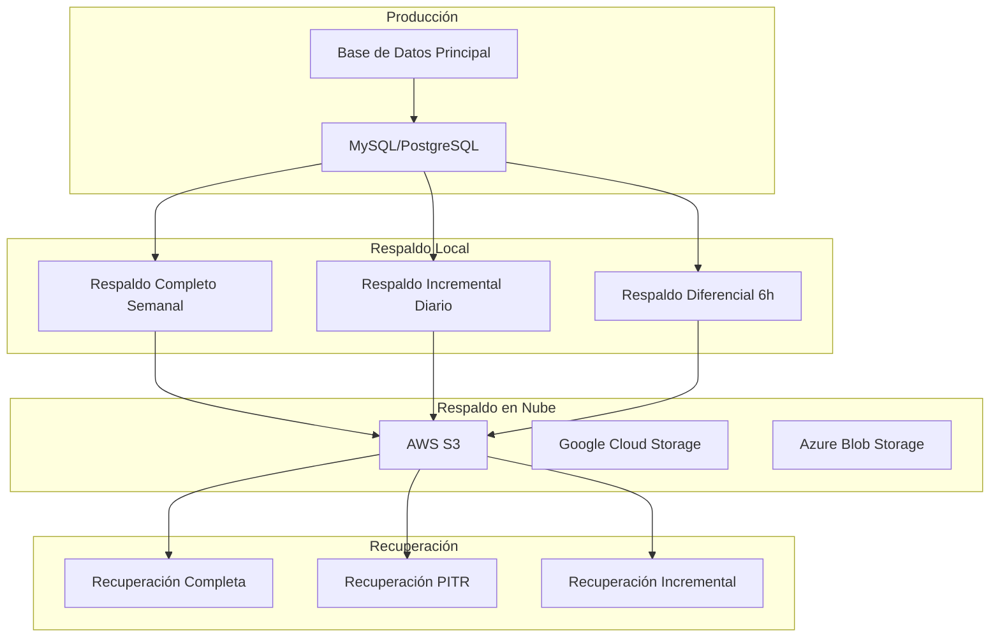
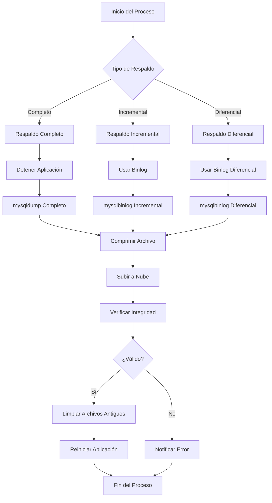
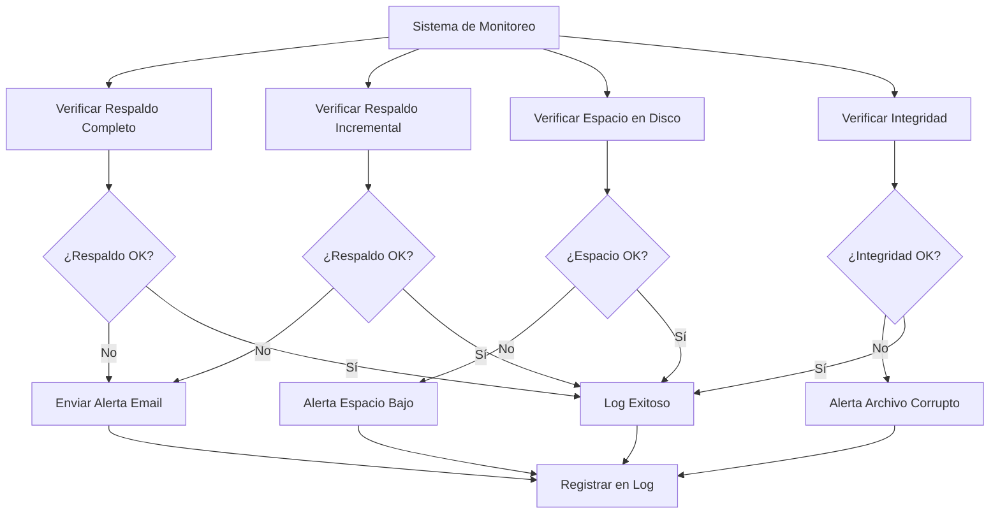
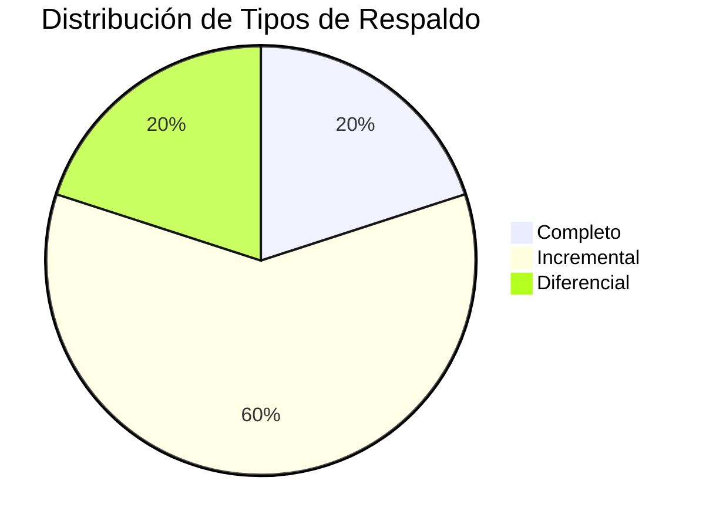
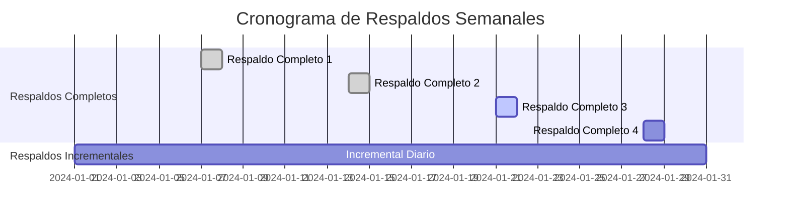

# Análisis de Respaldo de Base de Datos - Segunda Entrega

## Diagrama de Estrategia de Respaldo



## Estrategia de Respaldo

### Tipos de Respaldo

#### 1. Respaldo Completo (Full Backup)
- **Frecuencia:** Semanal (domingos a las 2:00 AM)
- **Retención:** 4 semanas
- **Ubicación:** Servidor local + Nube
- **Tamaño estimado:** 500MB - 2GB

#### 2. Respaldo Incremental
- **Frecuencia:** Diario (2:00 AM)
- **Retención:** 30 días
- **Ubicación:** Servidor local + Nube
- **Tamaño estimado:** 50MB - 200MB

#### 3. Respaldo Diferencial
- **Frecuencia:** Cada 6 horas
- **Retención:** 7 días
- **Ubicación:** Servidor local
- **Tamaño estimado:** 100MB - 500MB

### Configuración de Respaldo

#### Script de Respaldo Completo
```bash
#!/bin/bash
# backup_full.sh - Respaldo completo de Chronos DB

DATE=$(date +%Y%m%d_%H%M%S)
BACKUP_DIR="/backups/chronos/full"
DB_NAME="chronos_db"
DB_USER="chronos_backup"
DB_PASS="chronos_backup_pass_2024"

# Crear directorio si no existe
mkdir -p $BACKUP_DIR

# Respaldo completo
mysqldump -u $DB_USER -p$DB_PASS \
    --single-transaction \
    --routines \
    --triggers \
    --events \
    --hex-blob \
    --add-drop-database \
    --create-options \
    $DB_NAME > $BACKUP_DIR/chronos_full_$DATE.sql

# Comprimir
gzip $BACKUP_DIR/chronos_full_$DATE.sql

# Subir a nube (AWS S3)
aws s3 cp $BACKUP_DIR/chronos_full_$DATE.sql.gz s3://chronos-backups/full/

# Limpiar respaldos antiguos (más de 4 semanas)
find $BACKUP_DIR -name "chronos_full_*.sql.gz" -mtime +28 -delete

echo "Respaldo completo completado: chronos_full_$DATE.sql.gz"
```

#### Script de Respaldo Incremental
```bash
#!/bin/bash
# backup_incremental.sh - Respaldo incremental de Chronos DB

DATE=$(date +%Y%m%d_%H%M%S)
BACKUP_DIR="/backups/chronos/incremental"
DB_NAME="chronos_db"
DB_USER="chronos_backup"
DB_PASS="chronos_backup_pass_2024"

# Crear directorio si no existe
mkdir -p $BACKUP_DIR

# Obtener binlog actual
BINLOG_FILE=$(mysql -u $DB_USER -p$DB_PASS -e "SHOW MASTER STATUS\G" | grep File | awk '{print $2}')
BINLOG_POS=$(mysql -u $DB_USER -p$DB_PASS -e "SHOW MASTER STATUS\G" | grep Position | awk '{print $2}')

# Respaldo incremental usando binlog
mysqlbinlog --start-position=$BINLOG_POS /var/lib/mysql/$BINLOG_FILE > $BACKUP_DIR/chronos_incremental_$DATE.sql

# Comprimir
gzip $BACKUP_DIR/chronos_incremental_$DATE.sql

# Subir a nube
aws s3 cp $BACKUP_DIR/chronos_incremental_$DATE.sql.gz s3://chronos-backups/incremental/

# Limpiar respaldos antiguos (más de 30 días)
find $BACKUP_DIR -name "chronos_incremental_*.sql.gz" -mtime +30 -delete

echo "Respaldo incremental completado: chronos_incremental_$DATE.sql.gz"
```

## Configuración de MySQL para Respaldo

### my.cnf Configuration
```ini
[mysqld]
# Configuración para respaldos
log-bin=mysql-bin
binlog-format=ROW
expire_logs_days=7
max_binlog_size=100M
sync_binlog=1

# Configuración de InnoDB
innodb_flush_log_at_trx_commit=1
innodb_buffer_pool_size=128M
innodb_log_file_size=64M

# Configuración de seguridad
local_infile=0
```

### Configuración de Usuario de Respaldo
```sql
-- Crear usuario específico para respaldos
CREATE USER 'chronos_backup'@'%' IDENTIFIED BY 'chronos_backup_pass_2024';
GRANT SELECT, LOCK TABLES, SHOW VIEW, EVENT, TRIGGER ON chronos_db.* TO 'chronos_backup'@'%';
GRANT REPLICATION CLIENT ON *.* TO 'chronos_backup'@'%';
```

## Diagrama de Proceso de Respaldo



## Estrategia de Recuperación

### Escenarios de Recuperación

#### 1. Recuperación Completa
```bash
#!/bin/bash
# restore_full.sh - Recuperación completa

BACKUP_FILE=$1
DB_NAME="chronos_db"
DB_USER="chronos_admin"
DB_PASS="chronos_admin_pass_2024"

if [ -z "$BACKUP_FILE" ]; then
    echo "Uso: $0 <archivo_backup>"
    exit 1
fi

# Detener aplicación
systemctl stop chronos-app

# Crear nueva base de datos
mysql -u $DB_USER -p$DB_PASS -e "DROP DATABASE IF EXISTS $DB_NAME;"
mysql -u $DB_USER -p$DB_PASS -e "CREATE DATABASE $DB_NAME CHARACTER SET utf8mb4 COLLATE utf8mb4_unicode_ci;"

# Restaurar respaldo
if [[ $BACKUP_FILE == *.gz ]]; then
    gunzip -c $BACKUP_FILE | mysql -u $DB_USER -p$DB_PASS $DB_NAME
else
    mysql -u $DB_USER -p$DB_PASS $DB_NAME < $BACKUP_FILE
fi

# Verificar integridad
mysql -u $DB_USER -p$DB_PASS -e "USE $DB_NAME; CHECK TABLE usuario, materia, aula, horario, reserva;"

# Reiniciar aplicación
systemctl start chronos-app

echo "Recuperación completada exitosamente"
```

#### 2. Recuperación Punto en Tiempo (PITR)
```bash
#!/bin/bash
# restore_pitr.sh - Recuperación punto en tiempo

TARGET_TIME=$1
DB_NAME="chronos_db"
DB_USER="chronos_admin"
DB_PASS="chronos_admin_pass_2024"

if [ -z "$TARGET_TIME" ]; then
    echo "Uso: $0 'YYYY-MM-DD HH:MM:SS'"
    exit 1
fi

# Restaurar respaldo completo más reciente
LATEST_FULL=$(ls -t /backups/chronos/full/chronos_full_*.sql.gz | head -1)
gunzip -c $LATEST_FULL | mysql -u $DB_USER -p$DB_PASS $DB_NAME

# Aplicar binlogs hasta el tiempo objetivo
mysqlbinlog --stop-datetime="$TARGET_TIME" /var/lib/mysql/mysql-bin.* | mysql -u $DB_USER -p$DB_PASS $DB_NAME

echo "Recuperación PITR completada hasta $TARGET_TIME"
```

## Diagrama de Monitoreo y Alertas



## Monitoreo y Alertas

### Script de Monitoreo
```bash
#!/bin/bash
# backup_monitor.sh - Monitoreo de respaldos

BACKUP_DIR="/backups/chronos"
LOG_FILE="/var/log/chronos/backup_monitor.log"

# Verificar respaldo completo más reciente
LATEST_FULL=$(find $BACKUP_DIR/full -name "chronos_full_*.sql.gz" -mtime -1 | wc -l)
if [ $LATEST_FULL -eq 0 ]; then
    echo "$(date): ALERTA - No se encontró respaldo completo en las últimas 24 horas" >> $LOG_FILE
    # Enviar email de alerta
    echo "Respaldo completo faltante" | mail -s "ALERTA: Respaldo Chronos" admin@universidad.edu
fi

# Verificar espacio en disco
DISK_USAGE=$(df $BACKUP_DIR | tail -1 | awk '{print $5}' | sed 's/%//')
if [ $DISK_USAGE -gt 80 ]; then
    echo "$(date): ALERTA - Espacio en disco bajo: ${DISK_USAGE}%" >> $LOG_FILE
    echo "Espacio en disco bajo: ${DISK_USAGE}%" | mail -s "ALERTA: Espacio Disco Chronos" admin@universidad.edu
fi

# Verificar integridad del último respaldo
LATEST_BACKUP=$(ls -t $BACKUP_DIR/full/chronos_full_*.sql.gz | head -1)
if [ -f "$LATEST_BACKUP" ]; then
    if ! gunzip -t "$LATEST_BACKUP" 2>/dev/null; then
        echo "$(date): ALERTA - Respaldo corrupto: $LATEST_BACKUP" >> $LOG_FILE
        echo "Respaldo corrupto detectado" | mail -s "ALERTA: Respaldo Corrupto Chronos" admin@universidad.edu
    fi
fi
```

### Configuración de Cron
```bash
# Crontab para respaldos automáticos
# Respaldo completo semanal (domingos 2:00 AM)
0 2 * * 0 /scripts/backup_full.sh >> /var/log/chronos/backup_full.log 2>&1

# Respaldo incremental diario (2:00 AM)
0 2 * * 1-6 /scripts/backup_incremental.sh >> /var/log/chronos/backup_incremental.log 2>&1

# Monitoreo cada hora
0 * * * * /scripts/backup_monitor.sh

# Limpieza de logs (mensual)
0 0 1 * * find /var/log/chronos -name "*.log" -mtime +30 -delete
```

## Documentación de Procedimientos

### Procedimiento de Respaldo Manual
1. **Notificar usuarios** sobre mantenimiento programado
2. **Detener aplicación** para evitar inconsistencias
3. **Ejecutar respaldo completo** usando script automatizado
4. **Verificar integridad** del respaldo generado
5. **Subir a nube** para redundancia
6. **Reiniciar aplicación** y verificar funcionamiento
7. **Documentar** el proceso en log de mantenimiento

### Procedimiento de Recuperación de Emergencia
1. **Evaluar alcance** del problema y datos afectados
2. **Notificar stakeholders** sobre la situación
3. **Identificar respaldo** más reciente sin corrupción
4. **Ejecutar recuperación** usando scripts apropiados
5. **Verificar integridad** de datos recuperados
6. **Realizar pruebas** de funcionalidad básica
7. **Comunicar resolución** a usuarios afectados
8. **Documentar incidente** y lecciones aprendidas

## Diagrama de Métricas y KPIs





## Métricas y Reportes

### KPIs de Respaldo
- **Tiempo de respaldo completo:** < 30 minutos
- **Tiempo de respaldo incremental:** < 5 minutos
- **Tiempo de recuperación completa:** < 2 horas
- **Tiempo de recuperación PITR:** < 1 hora
- **Disponibilidad de respaldos:** 99.9%
- **Integridad de respaldos:** 100%

### Reportes Semanales
- Resúmen de respaldos realizados
- Tiempos de respaldo y recuperación
- Alertas y problemas detectados
- Uso de espacio en disco
- Pruebas de recuperación realizadas
