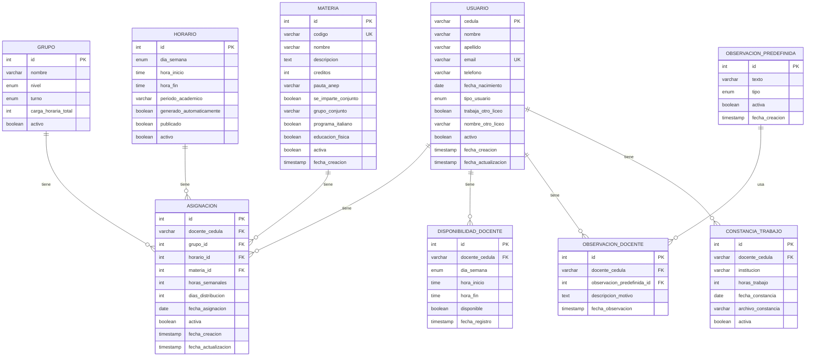
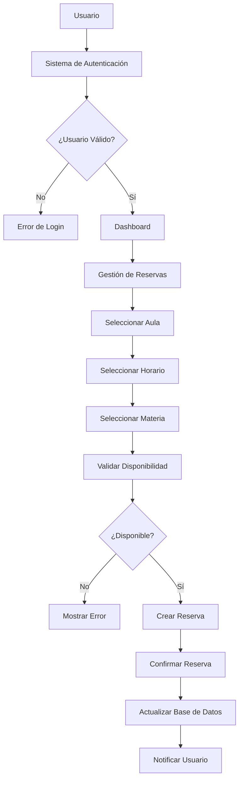
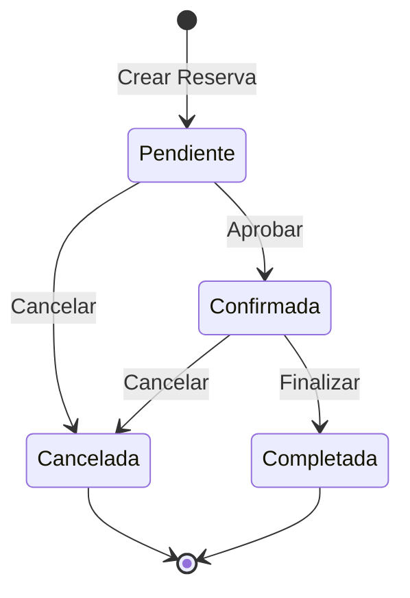

# Modelo Conceptual Corregido - Segunda Entrega

## Diagrama Entidad-Relación

## Entidades Principales

### Usuario
- **Atributos:**
  - cedula (PK) - VARCHAR(20) NOT NULL
  - nombre - VARCHAR(100) NOT NULL
  - apellido - VARCHAR(100) NOT NULL
  - email - VARCHAR(255) UNIQUE NOT NULL
  - telefono - VARCHAR(20)
  - fecha_nacimiento - DATE
  - tipo_usuario - ENUM('administrador', 'direccion', 'coordinador', 'docente', 'padre') NOT NULL
  - trabaja_otro_liceo - BOOLEAN DEFAULT FALSE
  - nombre_otro_liceo - VARCHAR(100)
  - activo - BOOLEAN DEFAULT TRUE
  - fecha_creacion - TIMESTAMP DEFAULT CURRENT_TIMESTAMP
  - fecha_actualizacion - TIMESTAMP DEFAULT CURRENT_TIMESTAMP ON UPDATE CURRENT_TIMESTAMP

### Materia
- **Atributos:**
  - id (PK) - INT AUTO_INCREMENT
  - codigo - VARCHAR(10) UNIQUE NOT NULL
  - nombre - VARCHAR(100) NOT NULL
  - descripcion - TEXT
  - creditos - INT NOT NULL
  - pauta_anep - VARCHAR(100)
  - se_imparte_conjunto - BOOLEAN DEFAULT FALSE
  - grupo_conjunto - VARCHAR(50)
  - programa_italiano - BOOLEAN DEFAULT FALSE
  - educacion_fisica - BOOLEAN DEFAULT FALSE
  - activa - BOOLEAN DEFAULT TRUE
  - fecha_creacion - TIMESTAMP DEFAULT CURRENT_TIMESTAMP

### Grupo
- **Atributos:**
  - id (PK) - INT AUTO_INCREMENT
  - nombre - VARCHAR(50) NOT NULL
  - nivel - ENUM('II_media', 'III_media', 'I_liceo_italiano') NOT NULL
  - turno - ENUM('matutino', 'vespertino') NOT NULL
  - carga_horaria_total - INT NOT NULL
  - activo - BOOLEAN DEFAULT TRUE

### Horario
- **Atributos:**
  - id (PK) - INT AUTO_INCREMENT
  - dia_semana - ENUM('lunes', 'martes', 'miercoles', 'jueves', 'viernes') NOT NULL
  - hora_inicio - TIME NOT NULL
  - hora_fin - TIME NOT NULL
  - periodo_academico - VARCHAR(20) NOT NULL
  - generado_automaticamente - BOOLEAN DEFAULT TRUE
  - publicado - BOOLEAN DEFAULT FALSE
  - activo - BOOLEAN DEFAULT TRUE

### Asignacion
- **Atributos:**
  - id (PK) - INT AUTO_INCREMENT
  - docente_cedula (FK) - VARCHAR(20) NOT NULL
  - grupo_id (FK) - INT NOT NULL
  - horario_id (FK) - INT NOT NULL
  - materia_id (FK) - INT NOT NULL
  - horas_semanales - INT NOT NULL
  - dias_distribucion - INT NOT NULL
  - fecha_asignacion - DATE NOT NULL
  - activa - BOOLEAN DEFAULT TRUE
  - fecha_creacion - TIMESTAMP DEFAULT CURRENT_TIMESTAMP
  - fecha_actualizacion - TIMESTAMP DEFAULT CURRENT_TIMESTAMP ON UPDATE CURRENT_TIMESTAMP

### DisponibilidadDocente
- **Atributos:**
  - id (PK) - INT AUTO_INCREMENT
  - docente_cedula (FK) - VARCHAR(20) NOT NULL
  - dia_semana - ENUM('lunes', 'martes', 'miercoles', 'jueves', 'viernes') NOT NULL
  - hora_inicio - TIME NOT NULL
  - hora_fin - TIME NOT NULL
  - disponible - BOOLEAN DEFAULT TRUE
  - fecha_registro - TIMESTAMP DEFAULT CURRENT_TIMESTAMP

### ObservacionDocente
- **Atributos:**
  - id (PK) - INT AUTO_INCREMENT
  - docente_cedula (FK) - VARCHAR(20) NOT NULL
  - observacion_predefinida_id (FK) - INT NOT NULL
  - descripcion_motivo - TEXT
  - fecha_observacion - TIMESTAMP DEFAULT CURRENT_TIMESTAMP

### ObservacionPredefinida
- **Atributos:**
  - id (PK) - INT AUTO_INCREMENT
  - texto - VARCHAR(200) NOT NULL
  - tipo - ENUM('otro', 'otro_liceo', 'personalizada') NOT NULL
  - activa - BOOLEAN DEFAULT TRUE
  - fecha_creacion - TIMESTAMP DEFAULT CURRENT_TIMESTAMP

### ConstanciaTrabajo
- **Atributos:**
  - id (PK) - INT AUTO_INCREMENT
  - docente_cedula (FK) - VARCHAR(20) NOT NULL
  - institucion - VARCHAR(100) NOT NULL
  - horas_trabajo - INT NOT NULL
  - fecha_constancia - DATE NOT NULL
  - archivo_constancia - VARCHAR(255)
  - activa - BOOLEAN DEFAULT TRUE

## Relaciones

### Usuario → Asignacion (1:N)
- Un docente puede tener múltiples asignaciones
- Una asignación pertenece a un solo docente

### Grupo → Asignacion (1:N)
- Un grupo puede tener múltiples asignaciones
- Una asignación pertenece a un solo grupo

### Horario → Asignacion (1:N)
- Un horario puede ser usado en múltiples asignaciones
- Una asignación tiene un solo horario

### Materia → Asignacion (1:N)
- Una materia puede tener múltiples asignaciones
- Una asignación es para una sola materia

### Usuario → DisponibilidadDocente (1:N)
- Un docente puede tener múltiples franjas de disponibilidad
- Una disponibilidad pertenece a un solo docente

### Usuario → ObservacionDocente (1:N)
- Un docente puede tener múltiples observaciones
- Una observación pertenece a un solo docente

### ObservacionPredefinida → ObservacionDocente (1:N)
- Una observación predefinida puede ser usada en múltiples observaciones
- Una observación de docente usa una observación predefinida

### Usuario → ConstanciaTrabajo (1:N)
- Un docente puede tener múltiples constancias de trabajo
- Una constancia pertenece a un solo docente

## Restricciones de Integridad

### Restricciones de Dominio
- cedula debe tener formato válido
- email debe tener formato válido
- capacidad del aula debe ser mayor a 0
- hora_fin debe ser mayor a hora_inicio
- fecha_reserva no puede ser en el pasado

### Restricciones de Clave Foránea
- usuario_cedula debe existir en tabla Usuario
- aula_id debe existir en tabla Aula
- horario_id debe existir en tabla Horario
- materia_id debe existir en tabla Materia

### Restricciones de Unicidad
- No puede haber dos reservas activas para el mismo aula y horario en la misma fecha
- Un usuario no puede tener dos reservas simultáneas

## Índices Recomendados

### Índices Primarios
- PRIMARY KEY en todas las tablas

### Índices Únicos
- UNIQUE en email de Usuario
- UNIQUE en codigo de Materia
- UNIQUE en (numero, edificio) de Aula

### Índices de Rendimiento
- INDEX en usuario_cedula de Reserva
- INDEX en aula_id de Reserva
- INDEX en fecha_reserva de Reserva
- INDEX en (aula_id, horario_id, fecha_reserva) de Reserva

## Diagrama de Flujo de Datos

## Diagrama de Estados de Reserva

## Consideraciones de Diseño

### Normalización
- Todas las tablas están en 3NF
- No hay redundancia de datos
- Cada atributo depende funcionalmente de la clave primaria

### Escalabilidad
- Uso de tipos de datos apropiados
- Índices optimizados para consultas frecuentes
- Consideración de particionado futuro por fecha

### Seguridad
- Campos sensibles encriptados si es necesario
- Auditoría de cambios con timestamps
- Soft delete para preservar integridad referencial
