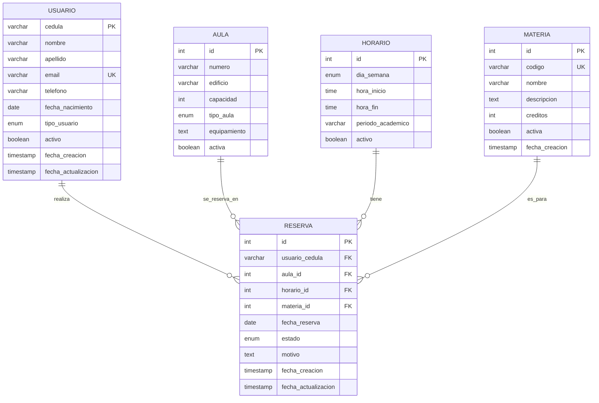

# Modelo Conceptual Corregido - Segunda Entrega

## Diagrama Entidad-Relación

## Entidades Principales

### Usuario
- **Atributos:**
  - cedula (PK) - VARCHAR(20) NOT NULL
  - nombre - VARCHAR(100) NOT NULL
  - apellido - VARCHAR(100) NOT NULL
  - email - VARCHAR(255) UNIQUE NOT NULL
  - telefono - VARCHAR(20)
  - fecha_nacimiento - DATE
  - tipo_usuario - ENUM('estudiante', 'profesor', 'administrador') NOT NULL
  - activo - BOOLEAN DEFAULT TRUE
  - fecha_creacion - TIMESTAMP DEFAULT CURRENT_TIMESTAMP
  - fecha_actualizacion - TIMESTAMP DEFAULT CURRENT_TIMESTAMP ON UPDATE CURRENT_TIMESTAMP

### Materia
- **Atributos:**
  - id (PK) - INT AUTO_INCREMENT
  - codigo - VARCHAR(10) UNIQUE NOT NULL
  - nombre - VARCHAR(100) NOT NULL
  - descripcion - TEXT
  - creditos - INT NOT NULL
  - activa - BOOLEAN DEFAULT TRUE
  - fecha_creacion - TIMESTAMP DEFAULT CURRENT_TIMESTAMP

### Aula
- **Atributos:**
  - id (PK) - INT AUTO_INCREMENT
  - numero - VARCHAR(10) NOT NULL
  - edificio - VARCHAR(50) NOT NULL
  - capacidad - INT NOT NULL
  - tipo_aula - ENUM('teoria', 'laboratorio', 'aula_magna') NOT NULL
  - equipamiento - TEXT
  - activa - BOOLEAN DEFAULT TRUE

### Horario
- **Atributos:**
  - id (PK) - INT AUTO_INCREMENT
  - dia_semana - ENUM('lunes', 'martes', 'miercoles', 'jueves', 'viernes', 'sabado') NOT NULL
  - hora_inicio - TIME NOT NULL
  - hora_fin - TIME NOT NULL
  - periodo_academico - VARCHAR(20) NOT NULL
  - activo - BOOLEAN DEFAULT TRUE

### Reserva
- **Atributos:**
  - id (PK) - INT AUTO_INCREMENT
  - usuario_cedula (FK) - VARCHAR(20) NOT NULL
  - aula_id (FK) - INT NOT NULL
  - horario_id (FK) - INT NOT NULL
  - materia_id (FK) - INT NOT NULL
  - fecha_reserva - DATE NOT NULL
  - estado - ENUM('pendiente', 'confirmada', 'cancelada', 'completada') DEFAULT 'pendiente'
  - motivo - TEXT
  - fecha_creacion - TIMESTAMP DEFAULT CURRENT_TIMESTAMP
  - fecha_actualizacion - TIMESTAMP DEFAULT CURRENT_TIMESTAMP ON UPDATE CURRENT_TIMESTAMP

## Relaciones

### Usuario → Reserva (1:N)
- Un usuario puede tener múltiples reservas
- Una reserva pertenece a un solo usuario

### Aula → Reserva (1:N)
- Un aula puede tener múltiples reservas
- Una reserva se realiza en un solo aula

### Horario → Reserva (1:N)
- Un horario puede ser usado en múltiples reservas
- Una reserva tiene un solo horario

### Materia → Reserva (1:N)
- Una materia puede tener múltiples reservas
- Una reserva es para una sola materia

## Restricciones de Integridad

### Restricciones de Dominio
- cedula debe tener formato válido
- email debe tener formato válido
- capacidad del aula debe ser mayor a 0
- hora_fin debe ser mayor a hora_inicio
- fecha_reserva no puede ser en el pasado

### Restricciones de Clave Foránea
- usuario_cedula debe existir en tabla Usuario
- aula_id debe existir en tabla Aula
- horario_id debe existir en tabla Horario
- materia_id debe existir en tabla Materia

### Restricciones de Unicidad
- No puede haber dos reservas activas para el mismo aula y horario en la misma fecha
- Un usuario no puede tener dos reservas simultáneas

## Índices Recomendados

### Índices Primarios
- PRIMARY KEY en todas las tablas

### Índices Únicos
- UNIQUE en email de Usuario
- UNIQUE en codigo de Materia
- UNIQUE en (numero, edificio) de Aula

### Índices de Rendimiento
- INDEX en usuario_cedula de Reserva
- INDEX en aula_id de Reserva
- INDEX en fecha_reserva de Reserva
- INDEX en (aula_id, horario_id, fecha_reserva) de Reserva

## Diagrama de Flujo de Datos

## Diagrama de Estados de Reserva

## Consideraciones de Diseño

### Normalización
- Todas las tablas están en 3NF
- No hay redundancia de datos
- Cada atributo depende funcionalmente de la clave primaria

### Escalabilidad
- Uso de tipos de datos apropiados
- Índices optimizados para consultas frecuentes
- Consideración de particionado futuro por fecha

### Seguridad
- Campos sensibles encriptados si es necesario
- Auditoría de cambios con timestamps
- Soft delete para preservar integridad referencial
