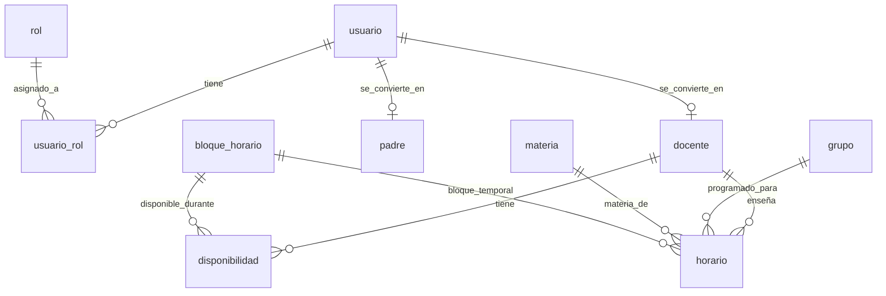
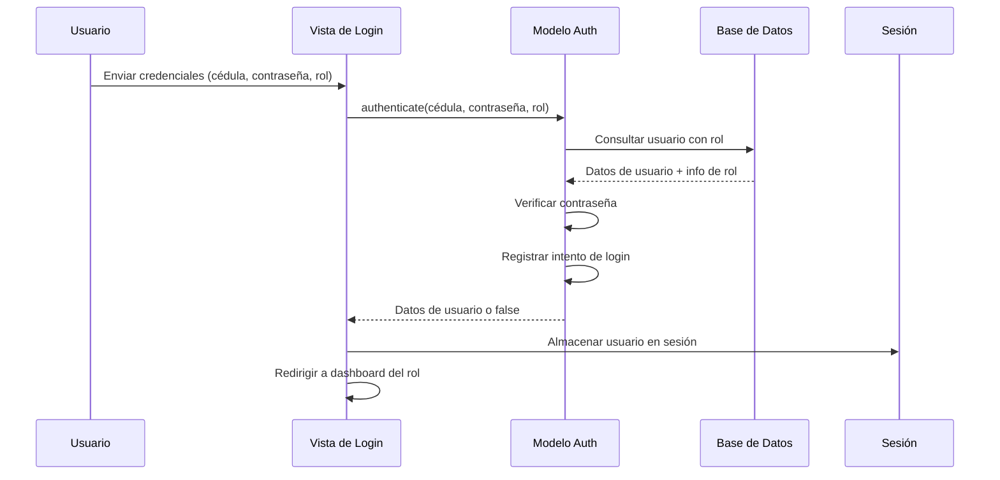

# Chronos - Documentación para Desarrolladores

> **Documento Vivo** - Esta documentación se actualiza continuamente para reflejar el estado actual del proyecto.

## 📋 Tabla de Contenidos

1. [Resumen del Proyecto](#resumen-del-proyecto)
2. [Stack Tecnológico](#stack-tecnológico)
3. [Arquitectura del Proyecto](#arquitectura-del-proyecto)
4. [Esquema de Base de Datos](#esquema-de-base-de-datos)
5. [Autenticación y Autorización](#autenticación-y-autorización)
6. [Referencia de API](#referencia-de-api)
7. [Configuración de Desarrollo](#configuración-de-desarrollo)
8. [Despliegue](#despliegue)
9. [Estándares de Código](#estándares-de-código)
10. [Pruebas](#pruebas)
11. [Solución de Problemas](#solución-de-problemas)
12. [Contribución](#contribución)

---

## 🎯 Resumen del Proyecto

**Chronos** es un sistema integral de gestión de horarios escolares (S.I.G.I.E) desarrollado para la Escuela Italiana de Uruguay (E.S.R.E). El sistema gestiona horarios de docentes, grupos de estudiantes, materias y tareas administrativas con soporte multiidioma (Español, Italiano, Inglés).

### Características Principales

- **Autenticación Multi-rol**: Roles de Administrador, Director, Coordinador, Docente, Padre
- **Identificación por Cédula**: Usuarios identificados por cédula uruguaya (7-8 dígitos)
- **Gestión de Horarios**: Gestión completa de horarios con pautas ANEP
- **Soporte Multiidioma**: Interfaces en Español, Italiano e Inglés
- **Diseño Responsivo**: UI moderna con TailwindCSS v4
- **Despliegue con Docker**: Entorno de desarrollo y producción containerizado

### Estado del Proyecto

- **Versión**: 1.0.0
- **Estado**: Desarrollo Activo
- **Última Actualización**: 2025
- **Esquema de Base de Datos**: v2.0.0

---

## 🛠 Stack Tecnológico

### Backend
- **PHP 8.1+**: Lenguaje del servidor
- **PostgreSQL 16**: Base de datos principal
- **PDO**: Capa de abstracción de base de datos
- **Gestión de Sesiones**: Manejo seguro de sesiones

### Frontend
- **HTML5**: Marcado semántico
- **TailwindCSS v4**: Framework CSS utility-first
- **JavaScript (ES6+)**: Funcionalidad del lado del cliente
- **Diseño Responsivo**: Enfoque mobile-first

### Infraestructura
- **Docker & Docker Compose**: Containerización
- **Nginx**: Servidor web y proxy inverso
- **Node.js 20**: Herramientas de construcción y compilación de assets
- **Ngrok**: Túnel de desarrollo (opcional)

### Herramientas de Desarrollo
- **Git**: Control de versiones
- **PostCSS**: Procesamiento de CSS
- **Autoprefixer**: Prefijos de vendedores CSS

---

## 🏗 Arquitectura del Proyecto

### Estructura de Directorios

```
chronos/
├── academic/                    # Entregables académicos (separados del código)
├── config/                      # Archivos de configuración
│   └── environment/            # Configuraciones específicas del entorno
├── docker/                     # Configuración de Docker
│   ├── nginx/                  # Configuración de Nginx
│   ├── php/                    # Dockerfile de PHP
│   └── postgres/               # Inicialización de base de datos
├── docs/                       # Documentación del proyecto
│   ├── database/               # Documentación de base de datos
│   └── DEVELOPER_DOCUMENTATION.md
├── public/                     # Archivos accesibles por web
│   ├── assets/                 # Assets estáticos
│   ├── css/                    # CSS compilado
│   ├── js/                     # Archivos JavaScript
│   └── index.php               # Punto de entrada principal
├── src/                        # Código fuente
│   ├── components/             # Componentes reutilizables
│   ├── config/                 # Configuración de la aplicación
│   ├── controllers/            # Manejadores de peticiones
│   ├── helpers/                # Funciones utilitarias
│   ├── lang/                   # Archivos de idioma
│   ├── models/                 # Modelos de datos
│   ├── views/                  # Plantillas de vista
│   └── tailwind.css            # Fuente de TailwindCSS
└── docker-compose.yml          # Configuración de servicios Docker
```

### Patrones de Arquitectura

#### Patrón MVC
- **Modelos**: Acceso a datos y lógica de negocio (`src/models/`)
- **Vistas**: Capa de presentación (`src/views/`)
- **Controladores**: Manejo de peticiones (`src/controllers/`)

#### Capa de Servicios
- **Servicio de Autenticación**: Autenticación y autorización (`src/models/Auth.php`)
- **Servicio de Base de Datos**: Gestión de conexiones de base de datos (`src/models/Database.php`)
- **Servicio de Traducción**: Soporte multiidioma (`src/helpers/Translation.php`)

#### Clases Helper
- **AuthHelper**: Utilidades de sesión y autenticación
- **Translation**: Sistema de internacionalización
- **LanguageSwitcher**: Componente de selección de idioma

---

## 🗄 Esquema de Base de Datos

### Tablas Principales

#### Gestión de Usuarios
- **`usuario`**: Cuentas de usuario con identificación por cédula
- **`rol`**: Roles y permisos del sistema
- **`usuario_rol`**: Relaciones muchos a muchos usuario-rol

#### Estructura Académica
- **`docente`**: Perfiles de docentes y disponibilidad
- **`padre`**: Perfiles de padres/tutores
- **`grupo`**: Grupos de estudiantes y niveles
- **`materia`**: Materias con pautas ANEP
- **`pauta_anep`**: Pautas de programación ANEP

#### Programación
- **`bloque_horario`**: Bloques de tiempo para programación
- **`disponibilidad`**: Disponibilidad de docentes por día/hora
- **`horario`**: Asignaciones de horarios reales
- **`docente_materia`**: Relaciones docente-materia

#### Sistema
- **`observacion`**: Observaciones y notas de docentes
- **`observacion_predefinida`**: Plantillas de observaciones predefinidas
- **`log`**: Registro de actividad del sistema

### Relaciones Clave



### Configuración de Base de Datos

```php
// src/config/database.php
return [
    'host' => 'postgres',
    'port' => '5432',
    'dbname' => 'chronos_db',
    'username' => 'chronos_user',
    'password' => 'chronos_pass',
    'options' => [
        PDO::ATTR_ERRMODE => PDO::ERRMODE_EXCEPTION,
        PDO::ATTR_DEFAULT_FETCH_MODE => PDO::FETCH_ASSOC,
        PDO::ATTR_EMULATE_PREPARES => false,
        PDO::ATTR_PERSISTENT => true
    ]
];
```

---

## 🔐 Autenticación y Autorización

### Identificación de Usuario
- **Clave Primaria**: Cédula uruguaya (7-8 dígitos)
- **Validación**: Patrón regex `/^\d{7,8}$/`
- **Unicidad**: La cédula debe ser única en todos los usuarios

### Control de Acceso Basado en Roles (RBAC)

#### Roles Disponibles
1. **ADMIN**: Acceso completo al sistema
2. **DIRECTOR**: Supervisión y supervisión escolar
3. **COORDINADOR**: Coordinación y gestión de horarios
4. **DOCENTE**: Docente con acceso limitado a su horario
5. **PADRE**: Padre con acceso de solo lectura a información del estudiante

#### Flujo de Autenticación



### Gestión de Sesiones

#### Características de Seguridad
- **Configuración de Sesión Segura**: Cookies HTTP-only, flags seguros
- **Timeout de Sesión**: 30 minutos de inactividad
- **Seguimiento de Actividad**: Actualizaciones de timestamp de última actividad
- **Cierre de Sesión Automático**: Invalidación de sesión en timeout

#### Configuración de Sesión
```php
// src/config/session.php
define('SESSION_TIMEOUT', 30); // minutos
define('SESSION_NAME', 'CHRONOS_SESSION');
define('SESSION_LIFETIME', 0); // hasta cerrar navegador
```

### Seguridad de Contraseñas
- **Hash**: PHP `password_hash()` con `PASSWORD_DEFAULT`
- **Verificación**: PHP `password_verify()`
- **Longitud Mínima**: 6 caracteres
- **Sin Recuperación de Contraseña**: El sistema requiere intervención de administrador

---

## 🔌 Referencia de API

### Endpoints de Autenticación

#### POST `/src/views/login.php`
**Propósito**: Autenticación de usuario

**Cuerpo de Petición**:
```json
{
    "ci": "12345678",
    "password": "contraseñausuario",
    "role": "DOCENTE"
}
```

**Respuesta**: Redirección al dashboard específico del rol

**Respuestas de Error**:
- `validation_ci_required`: Cédula es requerida
- `validation_ci_format`: Formato de cédula inválido
- `validation_password_required`: Contraseña es requerida
- `validation_password_length`: Contraseña muy corta
- `validation_role_required`: Selección de rol requerida
- `validation_auth_failed`: Credenciales inválidas

#### POST `/src/controllers/LogoutController.php`
**Propósito**: Cierre de sesión de usuario

**Cuerpo de Petición**:
```json
{
    "action": "logout"
}
```

**Respuesta**: Redirección a página de login con mensaje de éxito

### Métodos de Modelo

#### Modelo Auth (`src/models/Auth.php`)

```php
// Autenticar usuario
public function authenticate($cedula, $password, $role): array|false

// Crear nuevo usuario
public function createUser($userData): bool

// Validar formato de cédula
public function validateCedula($cedula): bool

// Verificar si cédula existe
public function cedulaExists($cedula): bool

// Actualizar contraseña de usuario
public function updatePassword($cedula, $newPassword): bool

// Obtener usuario por cédula
public function getUserByCedula($cedula): array|false

// Obtener todos los roles disponibles
public function getRoles(): array|false

// Cerrar sesión de usuario
public function logout($cedula): bool

// Verificar validez de sesión
public function isSessionValid($cedula, $timeoutMinutes = 30): bool
```

#### Clase AuthHelper (`src/helpers/AuthHelper.php`)

```php
// Verificar si usuario está logueado
public static function isLoggedIn(): bool

// Obtener datos del usuario actual
public static function getCurrentUser(): array|null

// Obtener rol del usuario actual
public static function getCurrentUserRole(): string|null

// Verificar si usuario tiene rol específico
public static function hasRole($role): bool

// Requerir que usuario esté logueado
public static function requireLogin($redirectUrl = null): void

// Requerir rol específico
public static function requireRole($requiredRole, $redirectUrl = null): void

// Obtener URL de redirección específica del rol
public static function getRoleRedirectUrl($role): string
```

---

## 🚀 Configuración de Desarrollo

### Prerrequisitos
- [Docker](https://docs.docker.com/get-docker) 20.10+
- [Node.js](https://nodejs.org/) 18+
- [Git](https://git-scm.com/downloads)

### Inicio Rápido

1. **Clonar el repositorio**
   ```bash
   git clone https://github.com/bocho8/chronos.git
   cd chronos
   ```

2. **Iniciar el entorno de desarrollo**
   ```bash
   docker compose up -d --build
   ```

3. **Acceder a la aplicación**
   - Aplicación principal: http://localhost
   - Base de datos: localhost:5432
   - Túnel Ngrok: http://localhost:4040 (si está configurado)

### Comandos de Desarrollo

#### Desarrollo de TailwindCSS
```bash
# Modo watch para compilación de CSS
npm run tw:dev

# Construcción de producción (minificado)
npm run tw:build
```

#### Comandos de Docker
```bash
# Ver logs
docker compose logs -f

# Detener servicios
docker compose stop

# Reiniciar servicios (preserva datos)
docker compose restart

# Reinicio limpio (⚠️ elimina base de datos)
docker compose down -v
```

### Configuración del Entorno

#### Conexión a Base de Datos
- **Host**: postgres (Docker) / localhost (externo)
- **Puerto**: 5432
- **Base de Datos**: chronos_db
- **Usuario**: chronos_user
- **Contraseña**: chronos_pass

#### Configuración de Ngrok (Opcional)
Crear `config/environment/ngrok.env`:
```
NGROK_AUTHTOKEN=tu_token_ngrok_aqui
```

### Cuenta de Administrador por Defecto
- **Cédula**: 12345678
- **Contraseña**: admin123
- **Rol**: ADMIN

---

## 🚢 Despliegue

### Despliegue de Producción

#### Configuración de Docker para Producción
1. **Actualizar variables de entorno** en `docker-compose.yml`
2. **Configurar Nginx** para producción en `docker/nginx/default.conf`
3. **Configurar certificados SSL** para HTTPS
4. **Configurar respaldos de base de datos**

#### Variables de Entorno
```bash
# Base de datos
POSTGRES_DB=chronos_prod
POSTGRES_USER=chronos_prod_user
POSTGRES_PASSWORD=contraseña_segura_produccion

# Aplicación
APP_ENV=production
APP_DEBUG=false
```

### Migración de Base de Datos
```bash
# Ejecutar esquema de base de datos
psql -h localhost -U chronos_user -d chronos_db -f docs/database/database_schema.sql
```

### Estrategia de Respaldo
```bash
# Respaldo de base de datos
docker exec chronos-postgres pg_dump -U chronos_user chronos_db > backup_$(date +%Y%m%d_%H%M%S).sql

# Restaurar desde respaldo
docker exec -i chronos-postgres psql -U chronos_user chronos_db < archivo_backup.sql
```

---

## 📝 Estándares de Código

### Estándares de PHP

#### Convenciones de Nomenclatura
- **Clases**: PascalCase (`AuthHelper`, `Database`)
- **Métodos**: camelCase (`getCurrentUser`, `validateCedula`)
- **Variables**: camelCase (`$userData`, `$redirectUrl`)
- **Constantes**: UPPER_SNAKE_CASE (`SESSION_TIMEOUT`)

#### Estructura de Código
```php
<?php
/**
 * Descripción de la Clase
 * 
 * @author Tu Nombre
 * @version 1.0.0
 */

class ClaseEjemplo {
    private $propiedad;
    
    /**
     * Descripción del método
     * 
     * @param string $parametro Descripción del parámetro
     * @return bool Descripción del retorno
     */
    public function metodoEjemplo($parametro) {
        // Implementación
    }
}
```

#### Manejo de Errores
```php
try {
    // Operaciones de base de datos
    $resultado = $stmt->execute();
    return $resultado;
} catch (PDOException $e) {
    error_log("Error de base de datos: " . $e->getMessage());
    return false;
}
```

### Estándares de Frontend

#### Estructura HTML
- Usar elementos HTML5 semánticos
- Incluir etiquetas ARIA apropiadas para accesibilidad
- Mantener sangría consistente (2 espacios)

#### Guías de CSS
- Usar clases utilitarias de TailwindCSS
- Estilos personalizados en etiquetas `<style>` cuando sea necesario
- Seguir diseño responsivo mobile-first

#### Estándares de JavaScript
- Usar características ES6+
- Incluir comentarios JSDoc para funciones
- Manejar errores graciosamente con try-catch

### Estándares de Base de Datos

#### Estructura de Consultas
```sql
-- Usar declaraciones preparadas
SELECT u.id_usuario, u.cedula, u.nombre 
FROM usuario u 
WHERE u.cedula = :cedula;

-- Incluir índices apropiados
CREATE INDEX idx_usuario_cedula ON usuario(cedula);

-- Agregar comentarios de tabla
COMMENT ON TABLE usuario IS 'Cuentas de usuario con identificación por cédula';
```

---

## 🧪 Pruebas

### Lista de Verificación de Pruebas Manuales

#### Pruebas de Autenticación
- [ ] Login válido con credenciales correctas
- [ ] Login inválido con credenciales incorrectas
- [ ] Timeout de sesión después de 30 minutos
- [ ] Redirecciones basadas en roles funcionan correctamente
- [ ] Cierre de sesión limpia la sesión apropiadamente

#### Pruebas de Validación de Formularios
- [ ] Validación de formato de cédula (7-8 dígitos)
- [ ] Validación de longitud de contraseña (mínimo 6 caracteres)
- [ ] Validación de selección de rol
- [ ] Validación del lado del cliente y del servidor

#### Pruebas de Base de Datos
- [ ] Creación de usuario con datos válidos
- [ ] Prevención de cédula duplicada
- [ ] Funcionalidad de asignación de roles
- [ ] Restricciones de integridad de datos

### Pruebas Automatizadas (Implementación Futura)

#### Pruebas Unitarias
```php
// Estructura de ejemplo de prueba
class PruebaAuth extends PHPUnit\Framework\TestCase {
    public function testValidarCedula() {
        $auth = new Auth($mockDb);
        $this->assertTrue($auth->validateCedula('12345678'));
        $this->assertFalse($auth->validateCedula('12345'));
    }
}
```

#### Pruebas de Integración
- Pruebas de conexión a base de datos
- Pruebas de flujo de autenticación
- Pruebas de endpoints de API

---

## 🔧 Solución de Problemas

### Problemas Comunes

#### Problemas de Conexión a Base de Datos
**Problema**: No se puede conectar a PostgreSQL
**Solución**: 
1. Verificar si los contenedores Docker están ejecutándose: `docker compose ps`
2. Verificar credenciales de base de datos en `src/config/database.php`
3. Revisar logs de PostgreSQL: `docker compose logs postgres`

#### Problemas de Sesión
**Problema**: Las sesiones no persisten
**Solución**:
1. Revisar configuración de sesión en `src/config/session.php`
2. Verificar configuración de cookies
3. Revisar permisos del directorio de sesión de PHP

#### CSS No Carga
**Problema**: Los estilos de TailwindCSS no se aplican
**Solución**:
1. Ejecutar `npm run tw:build` para compilar CSS
2. Verificar que `public/css/styles.css` existe
3. Verificar que la configuración de Nginx sirve archivos estáticos

#### Problemas de Permisos
**Problema**: Errores de permisos de archivos
**Solución**:
```bash
# Corregir permisos de archivos
sudo chown -R $USER:$USER .
chmod -R 755 public/
chmod -R 644 src/
```

### Modo Debug

#### Habilitar Registro de Debug
```php
// Agregar al inicio de archivos PHP para debugging
error_reporting(E_ALL);
ini_set('display_errors', 1);
```

#### Registro de Consultas de Base de Datos
```php
// Habilitar modo de error PDO
$pdo->setAttribute(PDO::ATTR_ERRMODE, PDO::ERRMODE_EXCEPTION);
```

### Problemas de Rendimiento

#### Optimización de Base de Datos
- Revisar planes de ejecución de consultas
- Asegurar indexación apropiada
- Monitorear registro de consultas lentas

#### Optimización de Frontend
- Minificar CSS y JavaScript
- Optimizar imágenes
- Habilitar caché del navegador

---

## 🤝 Contribución

### Flujo de Trabajo de Desarrollo

1. **Crear Rama de Característica**
   ```bash
   git checkout -b feature/nombre-nueva-caracteristica
   ```

2. **Realizar Cambios**
   - Seguir estándares de código
   - Agregar comentarios apropiados
   - Probar exhaustivamente

3. **Confirmar Cambios**
   ```bash
   git add .
   git commit -m "feat: agregar descripción de nueva característica"
   ```

4. **Enviar y Crear Pull Request**
   ```bash
   git push origin feature/nombre-nueva-caracteristica
   ```

### Convención de Mensajes de Commit

```
tipo(alcance): descripción

feat: agregar nuevo método de autenticación
fix: resolver problema de timeout de sesión
docs: actualizar documentación de API
style: formatear código según estándares
refactor: mejorar rendimiento de consulta de base de datos
test: agregar pruebas unitarias para clase Auth
```

### Proceso de Revisión de Código

1. **Auto Revisión**: Revisar tu propio código antes de enviar
2. **Revisión por Pares**: Solicitar revisión de miembros del equipo
3. **Pruebas**: Asegurar que todas las pruebas pasen
4. **Documentación**: Actualizar documentación relevante

### Reporte de Problemas

Al reportar problemas, incluir:
- **Entorno**: SO, versión de PHP, versión de Docker
- **Pasos para Reproducir**: Pasos detallados de reproducción
- **Comportamiento Esperado**: Qué debería pasar
- **Comportamiento Actual**: Qué pasa realmente
- **Mensajes de Error**: Mensajes de error completos y logs

---

## 📚 Recursos Adicionales

### Enlaces de Documentación
- [Estructura del Proyecto](PROJECT_STRUCTURE.md)
- [Esquema de Base de Datos](database/database_schema.sql)
- [Guía de Referencia Rápida](QUICK_REFERENCE.md)
- [Changelog](CHANGELOG.md)
- [README](../README.md)

### Recursos Externos
- [Documentación de PHP](https://www.php.net/docs.php)
- [Documentación de PostgreSQL](https://www.postgresql.org/docs/)
- [Documentación de TailwindCSS](https://tailwindcss.com/docs)
- [Documentación de Docker](https://docs.docker.com/)

### Herramientas de Desarrollo
- [DBeaver](https://dbeaver.io/) - Administración de base de datos
- [Postman](https://www.postman.com/) - Pruebas de API
- [VS Code](https://code.visualstudio.com/) - IDE recomendado

---

## 📞 Soporte

Para soporte técnico o preguntas:
- **Problemas del Repositorio**: [GitHub Issues](https://github.com/bocho8/chronos/issues)
- **Actualizaciones de Documentación**: Enviar pull requests a este archivo
- **Contacto de Emergencia**: [Información de Contacto]

---

**Última Actualización**: 2025-01-27  
**Versión del Documento**: 1.0.0  
**Mantenido Por**: Equipo de Desarrollo

---

> **Nota**: Este es un documento vivo. Por favor manténgalo actualizado conforme el proyecto evoluciona. Al realizar cambios en el código base, asegúrese de que esta documentación refleje el estado actual del sistema.